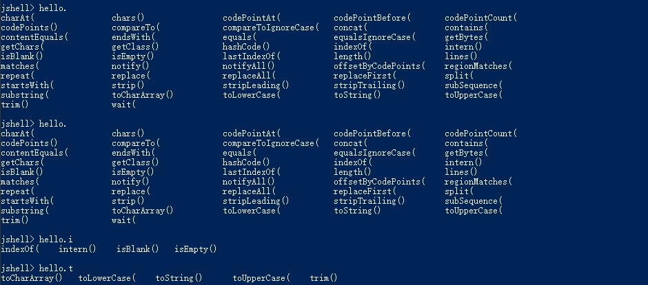
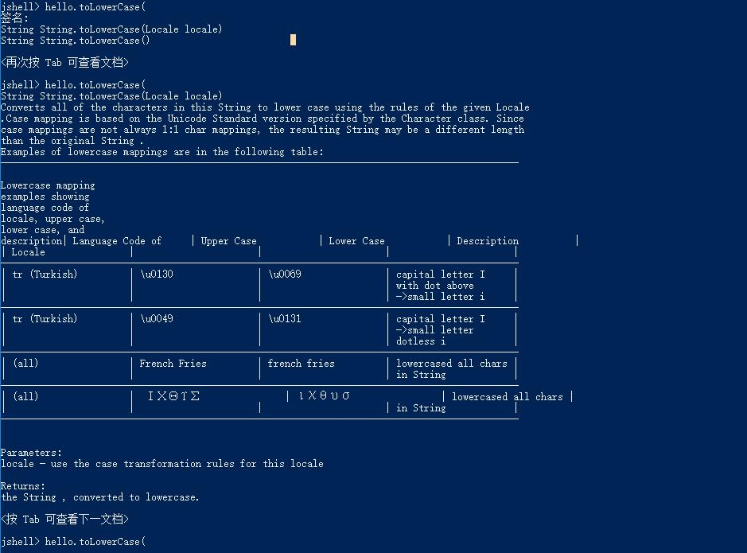
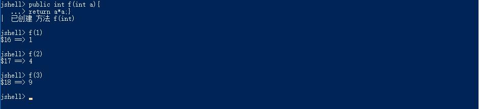
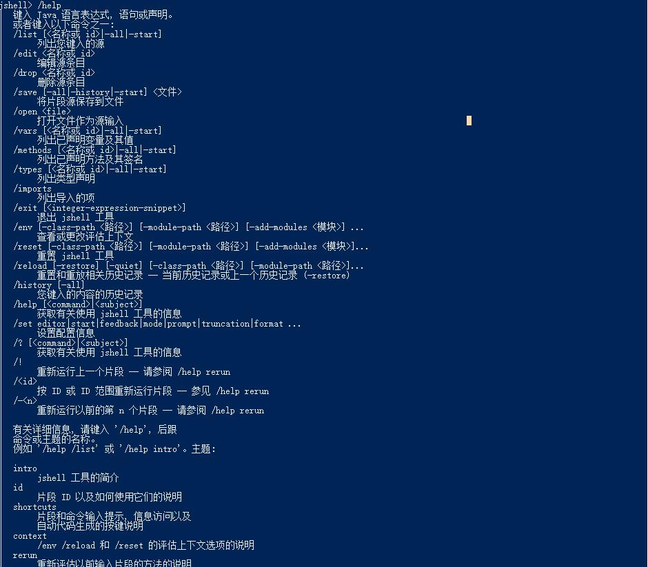
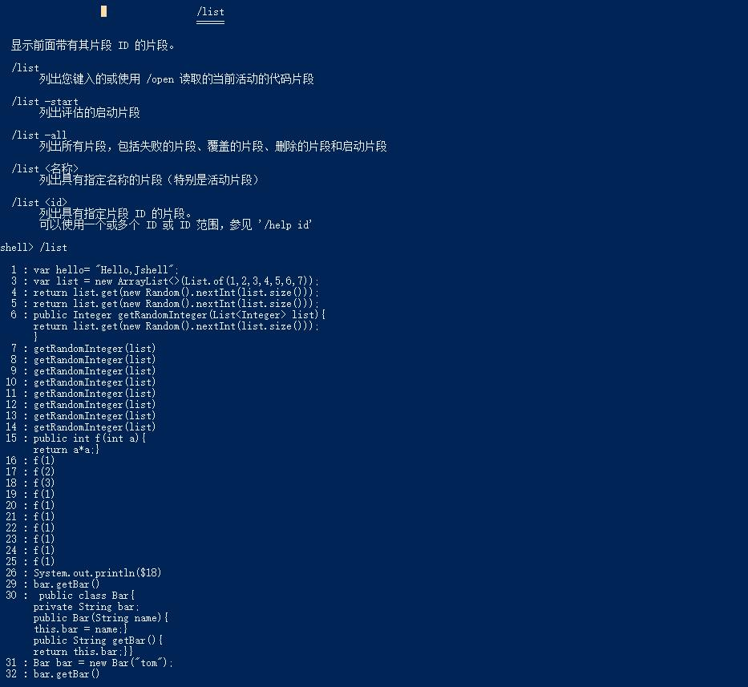
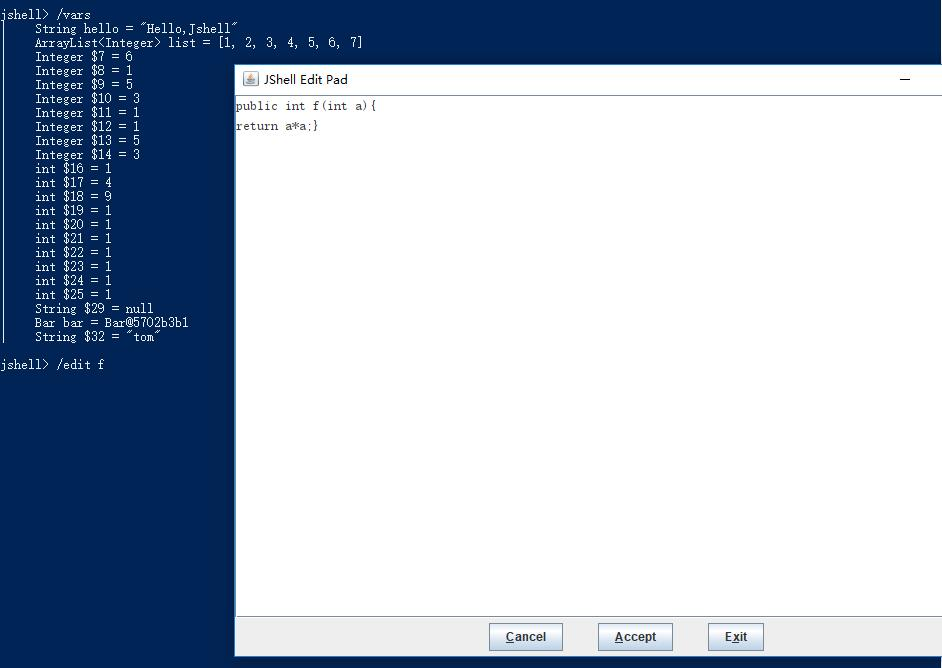
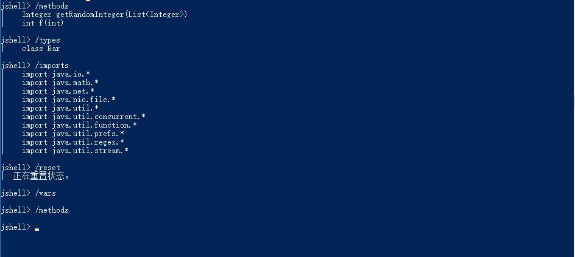
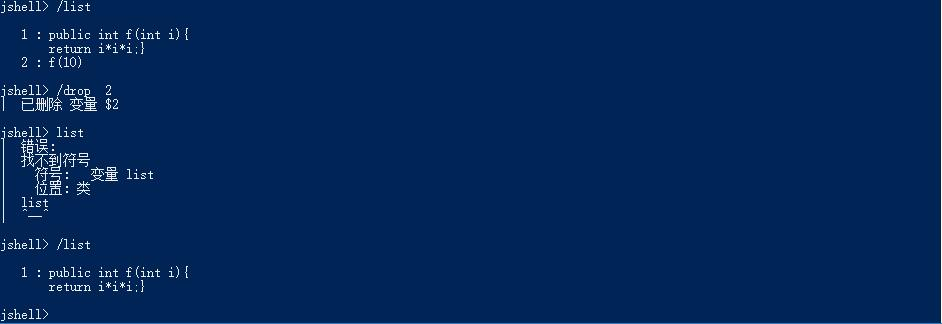

# Java9-11 新特性
___
##  [Jshell](Jshell)


## List.of()/Map.of()/Set.of()

## var

## interface 
### private static method
### public static method


##Java DOC

##  

# Jshell
____
## 1. 介绍

* Java shell /Jshell  是用来学习Java 编程语言和原型测试代码的交互式工具。Jshell在命令行运行，可以读取-求值-打印-循环，它对输入的声明、语句和表达式求值，并立即显示结果与ipython 类似,在Java9 被引入
* Jshell提供了交互式shell来快速原型测试、调试、学习java 和java apis，在执行前无需 public static void main 方法或者需要在执行前进行编译
## 2. 开始

* cd到jdk 目录，输入jshell 
* var  关键字与c# 的var 类似
``` java
	Windows Powershell:  C:\Program Files\Java\jdk-11.0.2\bin> .\jshell.exe
	
	|  欢迎使用 JShell -- 版本 11.0.2
	|  要大致了解该版本, 请键入: /help intro
	
	jshell>
	jshell> var hello= "Hello,Jshell"
	hello ==> "Hello,Jshell"

```

## 3. Tab 补全
```java
输入
jshell> var word = he

```
之后按tab  键，Jshell  自动补全为hello
对象hello. 会列出所有的方法,hello.t 会列出所有以t开头的方法
<div align="center">  </div><br>
查看方法签名与文档
<div align="center">  </div><br>

## 默认导入 imports

jshell> var list = new ArrayList<>(List.of(1,2,3,4,5,6,7))

list ==> [1, 2, 3, 4, 5, 6, 7]

List.of() 在java 9 被引入，可以直接使用ArrayList/List.of()，但我们并没有导入 java.util 包，这是因为JShell启动时自动地导入了一些包，以省去导入常用包或输入FQCN(Fully Qualified Class Name )。

默认导入列表

- java.io.*
- java.math.*
- java.net.*
- java.nio.file.*
- java.util.*
- java.util.concurrent.*
- java.util.function.*
- java.util.prefs.*
- java.util.regex.*
- java.util.stream.*

## 自定义方法
你可以直接定义一个实例方法而该方法无需在类里面，和ipython  类似
```java
jshell> public Integer getRandomInteger(List<Integer> list){
   ...> return list.get(new Random().nextInt(list.size()));
   ...> }
|  已创建 方法 getRandomInteger(List<Integer>)
```
<div align="center">  </div><br>
> 在ipython 里面我们可以直接定义lambda 方法，Jshell 里面还没看到类似的用法
<div align="center">  </div><br>
<div align="center">  </div><br>

## 抓取变量
> 抓取变量有通用的模式，以$开始，之后紧跟一个自增的数字

<div align="center">  </div><br>

## 定义类
你可以自定义一个类，并定义相应的方法/字段等
<div align="center">  </div><br>
缺点是定义的类格式不好，有错误也很难发现，更好的方式时是使用 /open

## 外部库
引用外部库
jshell --class-path /path/to/foo.jar

## Jshell Cmd

<div align="center">  </div><br>

<div align="center">  </div><br>

jshell> /list -start

-   s1 : import java.io.*;
-   s2 : import java.math.*;
-   s3 : import java.net.*;
-   s4 : import java.nio.file.*;
-   s5 : import java.util.*;
-   s6 : import java.util.concurrent.*;
-   s7 : import java.util.function.*;
-   s8 : import java.util.prefs.*;
-   s9 : import java.util.regex.*;
-  s10 : import java.util.stream.*;

/vars 列出所有声明的变量及其值
/edit 编辑某段代码

<div align="center">  </div><br>


/methods 列出所有声明的方法及方法签名

	jshell> /methods
	|    Integer getRandomInteger(List<Integer>)
	|    int f(int)
	
	jshell> f(1)
	$33 ==> 1
	
	jshell> /methods
	|    Integer getRandomInteger(List<Integer>)
	|    int f(int)
/types 列出所有声明的类型
/imports 列出所有当前的导入包
/reset 重置和清除所有的变量/方法/类型
<div align="center">  </div><br>

/save output.txt 保存之前的代码片段
/save 3-10 out.txt 保存3-10 的代码片段
/save -all all.txt 保存所有的会话，包括错误
<div align="center">  </div><br>

/open my_session.txt 打开之前保存的会话


##  参考文档
- [jshell](https://www.infoq.com/articles/jshell-java-repl?utm_campaign=rightbar_v2&utm_source=infoq&utm_medium=articles_link&utm_content=link_text)
- [Oracle jshell](https://docs.oracle.com/javase/9/jshell/introduction-jshell.htm#JSHEL-GUID-465BA4F5-E77D-456F-BCB7-D826AC1E18AE)