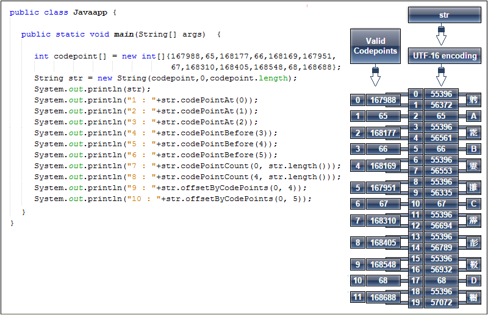

# String
___
Java 9 String 类新添加了两个方法 codePoints() 与 chars()，两者都
返回IntStream 对象

> 关于code points
<div align="center">  </div><br>

```java

int codepoint[] = new int[]{167988,65,168177,66};
String s = new String(codepoint,0, codepoint.length);
System.out.println("Str = " + s);
System.out.println("code points int stream:");
**s.codePoints().forEach(x -> System.out.println(x));**
System.out.println("*******************");
System.out.println("chars int stream:");
** s.chars().forEach(x -> System.out.println(x));**
System.out.println("*******************");

System.out.println("char array length: " + s.length());
System.out.println("code Point Length: "+ s.codePointCount(0,s.length()));
System.out.println("*******************");
```
output:
```java
Str = 𩀴A𩃱B
code points int stream:
167988
65
168177
66
*******************
chars int stream:
55396
56372
65
55396
56561
66
*******************
char array length: 6
code Point Length: 4
*******************
```
## java 11
```java
// isBlank()
String s = "abc";
System.out.println(s.isBlank());
s = "";
System.out.println(s.isBlank());

// lines()
String s1 = "Hi\nHello\rHowdy";
System.out.println(s1);
// 收集到List 
List lines = s1.lines().collect(Collectors.toList());
System.out.println(lines);

// strip(), stripLeading(), stripTrailing()
// 两端，头部，尾部去white space 
String s3 = "  Java,  \tPython\t ";
System.out.println("#" + s3 + "#");
System.out.println("#" + s3.strip() + "#");
System.out.println("#" + s3.stripLeading() + "#");
System.out.println("#" + s3.stripTrailing() + "#");

// repeat()
// repteat n 次,为了性能内部实现为System.arrayCopy() 方法
//final int limit = len * count;
//final byte[] multiple = new byte[limit];
//System.arraycopy(value, 0, multiple, 0, len);
//int copied = len;
//for (; copied < limit - copied; copied <<= 1) {
//    System.arraycopy(multiple, 0, multiple, copied, copied);
//}
//System.arraycopy(multiple, 0, multiple, copied, limit - copied);

s3 = "Co";
System.out.println(s3.repeat(2)); // CoCo
```

## 参考文献
- [java-string-codepoints](https://hajsoftutorial.com/java-string-codepoints/)
- [java-string](https://www.journaldev.com/16928/java-string)


